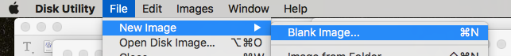
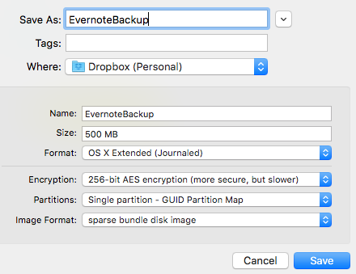

EvernoteBackup
===

A script to export all Evernote notes into a disk image for backup purposes.
By [Levi Brown](mailto:levigroker@gmail.com)
Version 1.0.1 March 17th, 2016
https://github.com/levigroker/EvernoteBackup

This script is designed to be executed automatically via a launchd
configuration, or manually. When executed, the script will:

1. Mount the encrypted sparse bundle disk image specified in the script's
	`pImageFile` property.
2. Create a temporary directory on the startup disk for the exported notes.
3. Create a directory representing each notebook inside the temporary directory.
4. Launch Evernote and wait for it to initialize.
5. For each notebook, export every note as an individual file into the
	notebook's directory. [1]
6. Quit Evernote.
7. Compress the contents of the temporary directory (zip) into a single file
	at the root level of the target disk image.
8. Delete the temporary directory and contents.
9. Delete old versions of the zip archive in the disk image.
10. Unmount the disk image.  

NOTE: This script has been tested on Mac OS X 10.11.3 under US English and
	may contain i18n issues which are not accounted for.

[1] Each note is exported as its own file as opposed to letting Evernote
	export multiple notes into a single file for two reasons: 1) Evernote has
	a 200 MB import limit for a single file, which I've run into (I keep a
	lot of PDFs), so saving the notes as individual files avoids this issue
	(I have yet to have a single 200 MB note). 2) Exporting into single files
	allows the preservation of the note's parent notebook. I've seen other
	approaches (scripts) where the notes are all exported into a file and
	they are all lumped together (the notebook organization is lost). So, my
	approach of exporting into a directory structure preserves this
	organization.

### Setup

1. Create an encrypted sparse bundle disk image using the Disk Utility
	application, which is of appropriate size to hold all your exported
	notes. The volume should be named "EvernoteBackup" (or change the name in
	the `pVolumeName` property).

	
	
	
2. Save the password to the disk image in your login Keychain so the image
	can be opened by the Finder without you needing to enter your password.
	(This can be done by opening the image from the Finder and checking the
	"Remember password in my keychain" checkbox in the resulting password
	dialog)

3. Change the `pImageFile` property in the script to match the location of
	your disk image. I place mine in my Dropbox folder so it will be backed
	up offsite.

4. Run the script from the Script Editor to make sure things work as expected.

5. Create a launchd configuration to automate the execution of the script
	([Lingon](https://www.peterborgapps.com/lingon/) is a nice GUI for
	managing launchd configurations). Or, as a convenience, I've included
	one: `com.levigroker.EvernoteBackup.plist`. You'll want to edit the file
	to change the path to the script, and optionally the execution time. I
	have it set for once a day at 1:00 in the morning, every day. Once ready,
	move the file into your user's `LaunchAgents` directory:

            ~/Library/LaunchAgents/com.levigroker.EvernoteBackup.plist
    
	You'll need to logout and back in (or restart) or load the configuration
	into `launchd` yourself (using the `launchctl` command).

### Restore

To restore, simply select all notes in a notebook directory and drag them into
Evernote. Evernote will then create a new notebook with the imported notes. You
can then use the `_notebook_name.txt` file in the notebook backup directory to
recover the original notebook name. Repeat this process for all notebooks.

#### Licence

* This work is licensed under the [Creative Commons Attribution 3.0 Unported License](http://creativecommons.org/licenses/by/3.0/).
  Please see the included LICENSE.txt for complete details.

#### About
A professional iOS engineer by day, my name is Levi Brown. Authoring a blog
[grokin.gs](http://grokin.gs), I am reachable via:

Twitter [@levigroker](https://twitter.com/levigroker)  
Email [levigroker@gmail.com](mailto:levigroker@gmail.com)  

Your constructive comments and feedback are always welcome.
